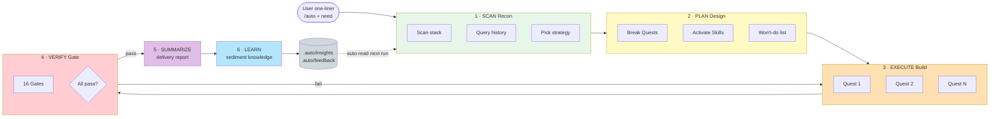

<div align="center">

# Auto CLI

**Give Claude Code / Codex a "Super Commander" — say one sentence, watch AI walk through a 6-phase pipeline, and write what it learned into your project's memory.**

[](./CHANGELOG.md)
[](./LICENSE)
[](#-why-use-it)
[](https://claude.com/claude-code)
[](https://github.com/openai/codex)
[](./docs/llms.txt)

[中文](./README.md) · [Changelog](./CHANGELOG.md) · [Repo Map](./REPO_MAP.md) · **[AI Navigation](./docs/llms.txt)**

</div>

---

## ✨ Understand in 5 seconds

```
You (type one line):  /auto Add user pagination with Spring Boot

AI (runs 6 phases automatically):
  1. SCAN       scan project + retrieve past experience
  2. PLAN       break into Quests + declare "won't-do" list
  3. EXECUTE    build quest by quest + live progress
  4. VERIFY     pass through 16 quality gates
  5. SUMMARIZE  delivery report (NO auto-commit)
  6. LEARN      sediment traps/patterns to .auto/insights, auto-reused next time
```

| What it IS                                                                      | What it is NOT                                                          |
| ------------------------------------------------------------------------------- | ----------------------------------------------------------------------- |
| A pure-Markdown instruction package, installed to `~/.claude/` or `~/.codex/`   | Not an IDE plugin, not a SaaS, no login required                        |
| A **protocol-driven** AI workflow that makes AI behavior repeatable & auditable | Not a model replacement — just makes existing models work more reliably |
| A **knowledge loop** that learns your project (LearnCard → insights)            | Not a black box — all artifacts are human-readable `.md` files          |

---

## 🚀 Quick Start (3 minutes)

### Step 1 · Install

**Option A · Claude Code Plugin Marketplace (recommended)**

```
/plugin marketplace add ktyyer/auto-cli
/plugin install auto-cli@auto-cli
```

**Option B · One command (includes Codex support)**

```bash
git clone https://github.com/ktyyer/auto-cli.git
cd auto-cli && npm run sync
```

> `npm run sync` auto-detects `~/.claude/` and `~/.codex/`, **only installs to runtimes that exist**.

### Step 2 · Try one sentence

Open Claude Code or Codex, type:

```
/auto Analyze the current project and find 3 improvement points
```

### Step 3 · Watch AI work

You'll see AI **not act immediately** — it does this first:

```
[Phase 1 SCAN]    ✓ Detected React + TS project, found 8 skills
[Phase 2 PLAN]    ✓ Strategy=explore, generated 3 analysis quests
[Phase 3 EXEC]    ✓ Quest 1/3 → 2/3 → 3/3 done
[Phase 4 VERIFY]  ✓ 5 gates passed
[Phase 5 SUMM]    ✓ 3 improvement recommendations output
[Phase 6 LEARN]   ✓ Experience written to .auto/insights/patterns.md
```

After completion, check:

```bash
ls .auto/runs/                    # all artifacts from this run
cat .auto/insights/patterns.md    # reusable patterns AI learned
```

> 🎯 **Key experience**: ask a similar question again, and AI will **auto-load** the traps and patterns from last time.

---

## 💡 Why use it

Mainstream AI coding tools solve **"how to use it stably"**. Auto CLI further solves **"how to make AI understand YOUR project better over time"**.

### Core differences vs alternatives

| Tool                     | Positioning                            | Auto CLI difference                                                          |
| ------------------------ | -------------------------------------- | ---------------------------------------------------------------------------- |
| Native Claude Code       | Single-conversation AI assistant       | Enforces 6-PHASE protocol, every run produces 5 auditable standard objects   |
| Superpowers              | 7-stage TDD pipeline (strong workflow) | 4 adaptive strategies (explore/fix/implement/refactor), TDD not forced       |
| GitHub Spec Kit          | spec → plan → tasks doc-driven         | Built-in constitution + spec-driven skill, **plus** LearnCard knowledge loop |
| Generic prompt templates | One-shot, no memory                    | `.auto/insights/` cross-run persistent memory, auto-injected next time       |

### 7 unique features

1. **Protocol-driven · 5 standard objects written to disk immediately** — `RouteDecision` / `QuestMap` / `QuestResult` / `VerifyReport` / `LearnCard` land in `.auto/runs/<runId>/`. Failures trace precisely to the failing Quest.
2. **Knowledge loop · learns YOUR project over time** — every trap/pattern/decision sediments to `.auto/insights/`. Next SCAN **auto-reverse-queries by keyword and injects**. PHASE 4 `knowledge-reuse` gate enforces "actually reused".
3. **Cross-session resumption · no need to re-explain** — when a run interrupts, `session-continuity.md` is written automatically. Next startup picks up with one line.
4. **Quest-level failure rollback · doesn't drag the whole repo** — failing quest rolls back only its own files; completed quests stay intact.
5. **16-Gate adaptive validation · not "lint passed = done"** — gate combinations chosen per strategy. Missing evidence reflows to EXECUTE.
6. **Context Engineering · manage AI's attention budget** — green/yellow/red zone dynamic compression, minimal-context validation lowers hallucination risk, long runs don't drift.
7. **Loop engine · `/auto 5m <goal>` autonomous loop until convergence** — one interval parameter turns the one-shot pipeline into a DOER + CHECKER loop: runs a focused 6-PHASE pass on schedule, a measurable checker decides "done", budget exhaustion stops it. auto-cli's memory / persistence / gates already are the loop trio — this just adds the scheduling layer.

> The #1 quality bottleneck for AI agents in 2026 is NOT model capability, **it's context management**. Auto CLI makes "the right tokens at the right time" the default behavior.

---

## 🧠 How it works

### 6-PHASE workflow



### What each PHASE does (plain English)

| Phase         | What it does                                                                                                                       | Analogy                                                        |
| ------------- | ---------------------------------------------------------------------------------------------------------------------------------- | -------------------------------------------------------------- |
| **SCAN**      | Check project's existing assets, look up past traps, judge complexity                                                              | Surveyor measures the house & checks records before renovation |
| **PLAN**      | Break into quests, each declares what files to touch / NOT touch / how to verify                                                   | Draft blueprints with "load-bearing wall MUST NOT be touched"  |
| **EXECUTE**   | Build quest by quest, write to disk every step. 3 anti-cheating mechanisms (file lock / expansion-word brake / no-shortcut pledge) | Workers follow blueprint, foreman watches constantly           |
| **VERIFY**    | Run 16 gates one by one. MUST paste command output, no "looks fine" allowed                                                        | Home inspection, every room photographed                       |
| **SUMMARIZE** | Output human-readable summary. **No auto-commit** — commit power stays with YOU                                                    | Delivery checklist for YOUR signature                          |
| **LEARN**     | Distill traps/patterns into LearnCards, dispatch to 5 files in `.auto/insights/`                                                   | Project retrospective, written to knowledge base               |

### 4 execution strategies (AI decides autonomously)

| Strategy      | Use case                     | Full path                                                                        |
| ------------- | ---------------------------- | -------------------------------------------------------------------------------- |
| **Explore**   | Analysis/consult/code review | SCAN → answer directly (fast path); complex analysis may run the full PHASE flow |
| **Fix**       | Bug / small tweak            | + build/test/self-verification gate                                              |
| **Implement** | New feature / multi-file     | + lint/coverage/self-critique + quest-designer breakdown                         |
| **Refactor**  | Architectural change         | + security/adversarial red-team validation                                       |

> AI in SCAN phase decides based on **task semantics + safety sensitivity + architectural impact**, NOT hard-coded by file count.

---

## 📚 Typical use cases

### Case 1 · New feature development (Implement strategy)

```bash
/auto Implement user registration with Spring Boot, password salted, with integration tests
```

**What happens**:

- SCAN identifies stack + reads `.auto/insights/traps.md` (avoids last time's "password not salted, rejected in review")
- PLAN calls `brainstorming` to let you choose JWT/Session/OAuth; calls `test-plan-writer` for a 6-dim test matrix
- Auto breaks into 5 quests: Entity → Service → Controller → Tests → Verification
- VERIFY runs build / test / lint / coverage / security (5 gates)
- LEARN writes "Spring Boot password salting template" to `.auto/insights/patterns.md`

### Case 2 · Bug fix (Fix strategy)

```bash
/auto User list crashes when pagination param is 0, fix and add test
```

**What happens**:

- Takes the fast-path, skips `quest-designer`
- Direct Read → Edit → run tests
- VERIFY validates build + test + self-verification

### Case 3 · Code review (Explore strategy, zero code changes)

```bash
/auto Review src/auth/ for potential security issues
```

**What happens**:

- Strategy = explore, **read-only throughout**
- Claude Code calls the `security-reviewer` agent; Codex uses a security-review validation view
- VERIFY runs read-only gates such as analysis / skill-activation / knowledge-reuse / clean-state
- LEARN writes "discovered potential threat patterns" to traps.md

### Case 4 · Cross-session resumption (no re-narration needed)

Session A is compressed due to context overflow, and auto-writes `session-continuity.md`.

Open session B, type `/auto`:

- SCAN detects `status=interrupted`
- Auto-shows "Last run paused at Quest 3/5 (Read done, waiting for Edit)"
- Continues by default, **no need to re-explain the prior conversation**

### Case 6 · Loop autonomous run (monitoring / self-heal / convergence)

```bash
/auto 5m watch CI until green, auto-fix on failure   # default budget $300 cap
/auto 30m raise test coverage from 62% to 80%
/auto 5m --budget 10000 refactor the whole module until tests pass  # allow up to $10000
/auto 5m --budget unlimited keep watching production               # no cost cap (still bounded by 72h + CHECKER)
```

**What happens**:

- SCAN parses the interval → enters loop mode, activates the `loop-engineering` skill
- Writes a loop contract first: goal + **measurable convergence criterion** (CI exit code 0 / coverage ≥ 80%) + budget (default maxIterations 20 / maxBudgetUsd 300 / maxWallClock 72h; `--budget` / `--max-time` override per-loop)
- Schedules each iteration via `ScheduleWakeup` (in-session) or `CronCreate` (overnight, durable)
- Each iteration runs a focused 6-PHASE pass → CHECKER runs the criterion command → progress: continue / regress: `git reset` + new strategy / met: stop
- LEARN feeds back across iterations: last run's traps are auto-avoided next run, until convergence or budget exhaustion

> If you can't write a measurable "done" criterion, loop won't start — a loop without a CHECKER is just a money burner.

---

## 🛠️ Installation

### Requirements

- **Node.js** ≥ 18 (for install scripts only; runtime is zero-dependency)
- **Claude Code** or **Codex** (at least one)

### Option A · Plugin Marketplace (Claude Code native)

```
/plugin marketplace add ktyyer/auto-cli
/plugin install auto-cli@auto-cli
```

Update: `/plugin update auto-cli`

### Option B · Source sync (recommended · required for Codex)

```bash
git clone https://github.com/ktyyer/auto-cli.git
cd auto-cli
npm run sync
```

`sync` auto-detects installed runtimes and syncs to their directories:

| Runtime     | Target dir   | Contents                                    |
| ----------- | ------------ | ------------------------------------------- |
| Claude Code | `~/.claude/` | commands + agents + skills + rules + hooks  |
| Codex       | `~/.codex/`  | prompts + skills + `AGENTS.md` bridge layer |

### Option C · Offline tgz distribution (air-gapped)

```bash
# In source repo
npm run pack                   # Output: auto-cli-<version>.tgz

# Target machine
tar -xzf auto-cli-<version>.tgz && cd package
node scripts/install.js        # macOS / Linux / Git Bash
scripts\install.bat            # Windows double-click
```

### Option D · One-click reinstall (dev machines)

```bash
npm run reinstall              # macOS / Linux / Git Bash
scripts\reinstall.bat          # Windows
```

Auto runs: pack → clean old resources → unpack new version → cleanup temp files.

### Uninstall

```bash
npm run uninstall              # In source repo
node scripts/uninstall.js      # In unpacked tgz dir
```

---

## 📖 Capability Overview

### 7 commands

| Command             | Purpose                                                             |
| ------------------- | ------------------------------------------------------------------- |
| `/auto`             | Super command — state your need, AI orchestrates                    |
| `/auto:route`       | Smart routing — analyze intent, recommend agent                     |
| `/auto:doctor`      | Environment diagnostic — health check + auto-fix                    |
| `/auto:status`      | Project status — runtime / capabilities / health                    |
| `/auto:dashboard`   | Historical run aggregation (strategy distribution / gate pass rate) |
| `/auto:learn`       | Git pattern analysis + LearnCard sedimentation                      |
| `/auto:create-hook` | Generate hook template suggestions                                  |

### 10 Agents (Claude Code exclusive)

| Agent                  | Role                                                                   |
| ---------------------- | ---------------------------------------------------------------------- |
| `quest-designer`       | Quest map designer (produces QuestMap for implement/refactor strategy) |
| `architect`            | System design / architecture decisions                                 |
| `tdd-guide`            | Test-driven development                                                |
| `code-reviewer`        | Code quality review                                                    |
| `security-reviewer`    | Security vulnerability detection                                       |
| `verification`         | Adversarial validation (red-team)                                      |
| `build-error-resolver` | Auto-fix build errors                                                  |
| `e2e-runner`           | Playwright E2E tests                                                   |
| `refactor-cleaner`     | Dead code cleanup                                                      |
| `doc-updater`          | Documentation sync                                                     |

> `agents/_shared-principles.md` defines shared principles, not invoked as a standalone agent.

### 38 Skills (cross-platform Anthropic Agent Skills standard)

<details>
<summary><b>Expand full skill list</b></summary>

| Skill                   | Domain                                                                |
| ----------------------- | --------------------------------------------------------------------- |
| `init-project`          | CLAUDE.md intelligent initialization                                  |
| `workflow-patterns`     | Workflow patterns + multi-agent orchestration + code review checklist |
| `code-style-enforcer`   | TS/JS + Java code style rules                                         |
| `git-workflow`          | Git branching + conventional commits                                  |
| `dependency-analyzer`   | Dependency security analysis                                          |
| `performance-patterns`  | Performance optimization patterns                                     |
| `java-patterns`         | Spring Boot + MyBatis Plus templates                                  |
| `error-patterns`        | Error pattern reference                                               |
| `robustness-patterns`   | Production robustness (retry/circuit-breaker/rate-limit/idempotency)  |
| `logging-patterns`      | Structured logging + observability                                    |
| `comment-standards`     | Code comment standards                                                |
| `production-governance` | Goal convergence + artifact truth + run state + skill health          |
| `production-standards`  | Production-ready standards                                            |
| `requirement-clarifier` | Requirement ambiguity assessment & clarification                      |
| `research-analyst`      | External resources / official docs research                           |
| `test-plan-writer`      | 6-dimension test plan generation                                      |
| `systematic-debugging`  | Systematic debugging methodology (4-stage)                            |
| `code-analyzer`         | tree-sitter code structure analysis                                   |
| `skill-creator`         | Skill authoring methodology                                           |
| `skill-evaluator`       | Skill health evaluation (structure + effectiveness dual-track)        |
| `prd-writer`            | PRD writing (conceptual → executable)                                 |
| `api-design`            | RESTful / pagination / error codes / OpenAPI                          |
| `refactoring-patterns`  | Safe refactoring methodology                                          |
| `spec-driven`           | Spec-driven development (contract → acceptance)                       |
| `context-engineering`   | Context engineering (budget / compression / isolation)                |
| `brainstorming`         | Multi-option comparison & tradeoff analysis                           |
| `plan-ensemble`         | Multi-perspective parallel planning & review synthesis                |
| `using-git-worktrees`   | Git Worktree multi-agent parallelism                                  |
| `constitution`          | `.auto/constitution.md` hard-constraint carrier                       |
| `incremental-review`    | End-of-session incremental review                                     |
| `self-critique`         | Per-quest Reflexion self-correction                                   |
| `quality-gates`         | VERIFY 16-gate definitions                                            |
| `knowledge-management`  | LEARN knowledge distillation + distribution + archive workflow        |
| `protocol-validator`    | Protocol object schema / handoff completeness validation              |
| `feedback-loop`         | I/O system self-verification loop (bot/daemon/CLI tools)              |
| `agentless-repair`      | Two-phase bug repair (localization + multi-candidate filtering)       |
| `predict-verify`        | Predict before impactful commands; wrong prediction = stop & rethink |
| `loop-engineering`      | `/auto <interval>` autonomous loop (DOER + CHECKER)                   |

</details>

Each skill contains a `## Activation Summary` section, supporting 3-tier on-demand activation:

- **Summary level** (match 3-4): read only ~20 lines → ~500 tokens
- **Full level** (5-6): summary + relevant sub-sections on demand → ~2000 tokens
- **Deep level** (7+): full + `references/` → ~5000 tokens

Low-match skills only read 20-line summary, **saving up to ~80% context** (summary ~500 vs deep ~5000 tokens, per tier token estimates).

### 22 Hooks (Claude Code automation)

| Event                                     | Count | Key hooks                                                                   |
| ----------------------------------------- | ----- | --------------------------------------------------------------------------- |
| `PreToolUse`                              | 7     | TDD Guard / Git Push Review / **Auto-Snapshot** (non-destructive git stash) |
| `PostToolUse`                             | 8     | Prettier+ESLint / type check / **Incremental Dirty Files**                  |
| `SessionStart`                            | 1     | Inject CLAUDE.md + constitution + last session-continuity                   |
| `PreCompact` / `PostCompact`              | 2     | Context compression rescue                                                  |
| `UserPromptSubmit`                        | 1     | Secret leak detection                                                       |
| `TeammateIdle` / `TaskCompleted` / `Stop` | 3     | Collaboration / quality gate / audit                                        |

### 10 Rules (coding standards, Claude Code auto-loaded)

`agents.md` · `coding-style.md` · `commands.md` · `git-workflow.md` · `hooks.md` · `markdown-authoring.md` · `performance.md` · `security.md` · `testing.md` · `version-and-release.md`

Rules with `paths` frontmatter are injected on-demand (only when touching matched files), reducing unrelated context.

---

## 🏗️ Architecture Deep Dive

### 5 standard protocol objects

Every `/auto` run is forced to produce these, landing in `.auto/runs/<runId>/`:

```
SCAN     → RouteDecision   routing decision (strategy + agent + budget + capability snapshot)
PLAN     → QuestMap        quest map (quest list + outOfScope + acceptance commands)
EXECUTE  → QuestResult     per-quest result (diff + validation + skill application evidence)
VERIFY   → VerifyReport    gate report (16 gates × status + actual evidence)
LEARN    → LearnCard       experience card (dispatched by category to insights/)
```

**Analogy**: factory assembly line work orders — each station consumes upstream standard parts, produces downstream standard parts. Failures locate precisely.

### 16-Gate validation matrix

| Gate                     | Meaning                                | Explore | Fix | Implement | Refactor |
| ------------------------ | -------------------------------------- | :-----: | :-: | :-------: | :------: |
| `analysis`               | Analysis completeness                  |    ✓    |  —  |     —     |    —     |
| `build`                  | Compile passes                         |    —    |  ✓  |     ✓     |    ✓     |
| `test`                   | Tests pass                             |    —    |  ✓  |     ✓     |    ✓     |
| `lint`                   | Code style                             |    —    |  —  |     ✓     |    ✓     |
| `coverage`               | Coverage ≥ 80%                         |    —    |  —  |     ✓     |    ✓     |
| `security`               | Security review                        |    —    |  —  |     —     |    ✓     |
| `adversarial`            | Red-team validation                    |    —    |  —  |     —     |    ✓     |
| `self-verification`      | AI self-check (code)                   |    —    |  ✓  |     ✓     |    ✓     |
| `self-critique`          | Reflexion self-correction (per quest)  |    —    |  —  |     ✓     |    ✓     |
| `production-governance`  | Production governance loop             |    —    |  —  |     ✓     |    ✓     |
| `protocol-validator`     | Protocol object completeness           |    —    |  ✓  |     ✓     |    ✓     |
| `skill-activation`       | Skill application evidence             |    ✓    |  ✓  |     ✓     |    ✓     |
| `knowledge-reuse`        | Historical experience reuse            |    ✓    |  ✓  |     ✓     |    ✓     |
| `knowledge-distribution` | LearnCard distribution hard-constraint |    ✓    |  ✓  |     ✓     |    ✓     |
| `clean-state`            | Repo resumable                         |    ✓    |  ✓  |     ✓     |    ✓     |
| `cost`                   | Token cost audit                       |    —    |  ✓  |     ✓     |    ✓     |

**Core constraints** (across all gates):

- **Run-Don't-Claim**: never say "tests passed" — must paste command + last 3 lines of output
- **Predict-Then-Verify**: before running any verify command, predict the result first. Wrong prediction = wrong understanding, stop and fix understanding
- **Protocol pre-validation**: `protocol-validator` checks required fields, conditional fields, and failed-gate next steps before phase handoff
- **Verification context isolation**: Claude Code may use subagents; Codex uses the main agent with minimal-context validation views by default, lowering hallucination risk and token cost

### Context Engineering

| Mechanism                            | What it does                                             | Benefit                               |
| ------------------------------------ | -------------------------------------------------------- | ------------------------------------- |
| **3-zone budget** (green/yellow/red) | Auto-writes `session-continuity.md` on entering red zone | AI never "forgets"                    |
| **Progressive disclosure**           | Skill 3-tier activation, low-match reads only 20 lines   | Save up to ~80% tokens                |
| **Verification context isolation**   | Validation views receive only minimal context            | Less hallucination + lower token cost |
| **Drift protection**                 | Echo the ask + reverse diff + expansion-word brake       | Long runs stay on mainline            |
| **Knowledge distillation**           | LearnCards atomic (≤5 lines) + scope-tagged              | Reuse actually works                  |
| **Run-level budget**                 | `maxIterations` 25 + `noProgressThreshold` 3             | Prevent runaway token burn            |

See `skills/context-engineering/SKILL.md` for details.

### Knowledge loop (the compounding flywheel)

```
This run's traps/wins
       │
       │ LearnCard
       ▼
.auto/insights/<category>.md       ← long-term memory
       │
       │ insight-index reverse lookup
       ▼
Next SCAN auto-preloads relevant LearnCards
       │
       │ Inject into QuestMap.pitfalls / knowledgeHints
       ▼
Next EXECUTE proactively avoids traps + reuses patterns
       │
       ▼
(loop, accumulates over runs)
```

5 dispatch files:

| File                | Contents                               |
| ------------------- | -------------------------------------- |
| `traps.md`          | Traps encountered + how to avoid       |
| `patterns.md`       | Validated effective patterns           |
| `decisions.md`      | Why A over B (architectural rationale) |
| `prompts.md`        | Reusable input templates               |
| `agent-feedback.md` | Agent / skill routing feedback         |

Every entry tagged with `scope`: `project` (project-only) / `stack` (same-stack reusable) / `universal` (cross-project).

---

## 🔧 Configuration & Customization

### `.auto/` directory structure

```
.auto/
├── runs/<runId>/       Per-run source of truth (route-decision/quest-map/quest-results/verify-report/learn-cards/index)
├── insights/           Long-term human-readable knowledge (5 .md files)
├── feedback/           Cross-run structured feedback (agents.json / skills.json)
├── cache/              Derived caches (insight-index / skill-extracts / capability-snapshot)
└── constitution.md     Optional · project hard constraints (PLAN/EXECUTE/VERIFY must comply)
```

### Constitution (project hard constraints)

Inspired by GitHub Spec Kit's `constitution.md` pattern. Create `.auto/constitution.md`:

```markdown
# Project Hard Constraints

1. All SQL must be parameterized; string concatenation forbidden
2. All APIs must use Result<T> envelope
3. Test coverage cannot fall below 85%
```

SCAN auto-injects into RouteDecision; PLAN/EXECUTE/VERIFY violation = `fail`.

### Custom skills

Create `skills/<your-skill>/SKILL.md` (compliant with [Anthropic Agent Skills standard](https://github.com/anthropics/skills)):

```markdown
---
name: your-skill
description: One-line description of trigger scenario
tags: [tag1, tag2]
---

## Activation Summary

[Actionable points within 20 lines]

## Details

...
```

SCAN auto-discovers by frontmatter; PLAN activates by 4-signal match score.

### Agent Skills standard compatibility

| Field                                                      | Standard | Auto CLI                                                |
| ---------------------------------------------------------- | -------- | ------------------------------------------------------- |
| `name`                                                     | Required | Required                                                |
| `description`                                              | Required | Required                                                |
| `tags`                                                     | —        | **Required** (auto-cli extension for dynamic discovery) |
| `license` / `compatibility` / `metadata` / `allowed-tools` | Optional | Optional                                                |

Source structure alignment means skills are natively recognized by **Claude Code**; Codex / OpenCode and similar runtimes reuse them through sync or bridge directories.

---

## 🌐 Runtime Support Matrix

| Capability                      | Claude Code           | Codex                                          |
| ------------------------------- | --------------------- | ---------------------------------------------- |
| `/auto` main command            | Native slash command  | `/prompts:auto`                                |
| 6-PHASE main flow               | Full support          | Supported (Codex-specific prompt)              |
| Sub-commands `/auto:route` etc. | Native slash commands | Supported (Codex override versions)            |
| Project `skills/`               | ✓                     | ✓                                              |
| Capability snapshot             | project scan          | Prefers `.auto/cache/capability-snapshot.json` |
| Custom agents                   | ✓                     | ✗ (uses `spawn_agent` only when explicit)      |
| rules / hooks                   | ✓                     | ✗                                              |

> Same-name `/auto` is **behavior-aligned** on both sides, but execution mechanisms differ (verified by grep on key terms across both runtimes).

---

## 📊 Real Run Examples

`.auto/runs/<runId>/` is the source of truth for each run (not in git, accumulates locally per project). Recent real cases from this repo:

| Run topic                       | Strategy  | Key output                                                      |
| ------------------------------- | --------- | --------------------------------------------------------------- |
| Project health check            | Explore   | Identified 5 doc inconsistencies + 1 validate script defect     |
| Consistency fix                 | Fix       | 6 Quests resolved all issues, `npm run check` turned green      |
| Strategic optimization analysis | Explore   | External research → 14 tiered recommendations                   |
| Incremental polish              | Implement | README moat + roadmap sync                                      |
| v0.44 implementation            | Implement | constitution / incremental-review / self-critique skills landed |
| v0.44.1 implementation          | Implement | Run-Budget + Knowledge Decay dual-runtime alignment             |

Each run directory contains the full 6 artifacts. Validate closure with `node scripts/validate-run-completeness.js --run <runId>`.

---

## ❓ FAQ

**Q: Commands don't take effect after install?**
Restart Claude Code or Codex.

**Q: Can non-technical users use it?**
Yes. Just type `/auto + your need` (in any language). AI auto-judges the execution path. **All artifacts are human-readable Markdown**, every step explained.

**Q: Will it auto-commit without typing `commit`?**
No. Auto CLI **never auto-commits** — commit power stays with you. SUMMARIZE phase only provides a change list; you say "commit" to trigger git.

**Q: Will my code leak externally?**
No. Auto CLI is a local Markdown instruction package only. No data is sent externally. All AI calls go through your installed Claude Code / Codex.

**Q: Why does Codex feel worse than Claude Code?**
Claude Code natively supports agents / rules / hooks runtime; Codex currently supports only prompts + skills. Both `/auto` are **behavior-aligned but execution mechanisms differ** — we install a Codex-specific `/auto` prompt + `AGENTS.md` bridge layer to approximate Claude experience.

**Q: Will `.auto/` pollute my git?**
No. `.auto/` is already in `.gitignore`. Each project accumulates its own local knowledge.

**Q: How to contribute a new Skill?**
Create your skill as `skills/<your-skill>/SKILL.md` (following Agent Skills standard + `tags` extension), run `node scripts/validate-references.js`, submit PR to `dev` branch. The `skills/community/` auto-discovery mechanism is under development — see `skills/community/README.md`.

**Q: Which languages are supported?**
Java / Spring Boot, JavaScript / TypeScript / React, Python / Django, Go / Gin, Rust (basic). Skills tagged `scope: universal` are language-agnostic.

---

## 🤝 Contributing

Welcomed contributions:

- 🐛 [Report a bug](https://github.com/ktyyer/auto-cli/issues/new?labels=bug)
- 💡 [Propose a new skill](https://github.com/ktyyer/auto-cli/issues/new?labels=skill)
- 📖 Documentation improvements (direct PR)
- 🌍 Multi-language translation (refer to `README.md`)

**Development flow**:

```bash
git clone https://github.com/ktyyer/auto-cli.git
cd auto-cli
npm install
npm run check      # format + reference + package contents + run completeness validation
```

Pre-commit hooks auto-run `prettier` and reference validation. Commit messages follow [Conventional Commits](https://www.conventionalcommits.org/).

---

## 📜 License

[MIT](./LICENSE) © Auto CLI Team

---

## 🙏 Credits

Built on the methodology and practices of these excellent open-source projects:

- [everything-claude-code](https://github.com/affaan-m/everything-claude-code) — Claude Code workflow reference
- [ai-max](https://github.com/zhukunpenglinyutong/ai-max) — Agent orchestration inspiration
- [Anthropic Agent Skills](https://github.com/anthropics/skills) — Skill standard alignment
- [GitHub Spec Kit](https://github.com/github/spec-kit) — Constitution pattern inspiration
- [obra/superpowers](https://github.com/obra/superpowers) — `systematic-debugging` skill integration

---

<div align="center">

**[⬆ Back to top](#auto-cli)** · **[中文版 README](./README.md)** · **[Changelog](./CHANGELOG.md)**

Made with ♥ for the 2026 AI-native development era

</div>
