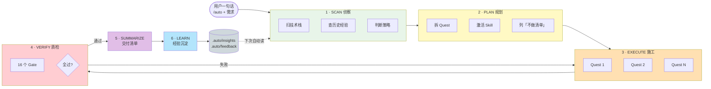

<div align="center">

# Auto CLI

**给 Claude Code / Codex 装一个"超级司令官" — 一句话需求，自动走完 6 步流水线，并把这次的经验写进项目记忆。**

[](./CHANGELOG.md)
[](./LICENSE)
[](#-为什么用它)
[](https://claude.com/claude-code)
[](https://github.com/openai/codex)

[English](./README.en.md) · [更新日志](./CHANGELOG.md) · [仓库地图](./REPO_MAP.md)

</div>

---

## ✨ 5 秒理解

```
你（敲一行）：/auto 用 Spring Boot 加个用户分页查询

AI（自动走 6 步）：
  1. SCAN     扫项目 + 查历史经验
  2. PLAN     拆 Quest + 列「不做清单」
  3. EXECUTE  逐关施工 + 实时进度
  4. VERIFY   过 16 道质检关
  5. SUMMARIZE 交付清单（不自动 commit）
  6. LEARN    踩坑/模式写进 .auto/insights，下次自动复用
```

| 它是什么                                                          | 它不是什么                                  |
| ----------------------------------------------------------------- | ------------------------------------------- |
| 一份纯 Markdown 指令包，安装到 `~/.claude/` 或 `~/.codex/` 后生效 | 不是 IDE 插件，不是 SaaS，不需要登录        |
| 一套**协议驱动**的 AI 工作流，让 AI 行为可重复、可审计            | 不是模型替代品，只让现有模型用得更稳更聪明  |
| 一个**越用越懂你项目**的知识闭环（LearnCard → insights）          | 不是黑盒——所有产物都是人类可读的 `.md` 文件 |

---

## 🚀 Quick Start（3 分钟跑起来）

### Step 1 · 安装

**方式 A · Claude Code 插件市场（推荐）**

```
/plugin marketplace add ktyyer/auto-cli
/plugin install auto-cli@auto-cli
```

**方式 B · 一行命令（含 Codex 支持）**

```bash
git clone https://github.com/ktyyer/auto-cli.git
cd auto-cli && npm run sync
```

> `npm run sync` 会自动检测 `~/.claude/` 和 `~/.codex/`，**只装存在的运行时**。

### Step 2 · 试一句话

打开 Claude Code 或 Codex，敲：

```
/auto 帮我分析一下当前项目，找 3 个可优化的点
```

### Step 3 · 看 AI 怎么工作

你会看到 AI **不动手立刻分析**，而是先做：

```
[Phase 1 SCAN]   ✓ 识别为 React + TS 项目，读到 8 个 skill
[Phase 2 PLAN]   ✓ 策略=探索，生成 3 个分析关卡
[Phase 3 EXEC]   ✓ Quest 1/3 → 2/3 → 3/3 完成
[Phase 4 VERIFY] ✓ 5 个 gate 全过
[Phase 5 SUMM ]  ✓ 输出 3 项优化建议清单
[Phase 6 LEARN]  ✓ 经验已写入 .auto/insights/patterns.md
```

完成后查看：

```bash
ls .auto/runs/  # 这次 run 的全部产物
cat .auto/insights/patterns.md  # AI 学到的可复用模式
```

> 🎯 **关键体验**：再问一次类似问题，AI 会**自动加载**上次踩过的坑和学到的招。

---

## 💡 为什么用它

业界主流 AI 编程工具解决了 **"怎么用得稳"**。Auto CLI 进一步解决了 **"怎么让 AI 越用越懂你的项目"**。

### 与同类的核心区别

| 方案             | 定位                           | Auto CLI 差异点                                                      |
| ---------------- | ------------------------------ | -------------------------------------------------------------------- |
| 原生 Claude Code | 单次对话型 AI 助手             | 强制 6 PHASE 协议，每次运行产出可审计的 5 个标准对象                 |
| Superpowers      | 7-stage TDD pipeline（强工艺） | 4 种自适应策略（探索/修复/实现/重构），不强制 TDD                    |
| GitHub Spec Kit  | spec → plan → tasks 文档驱动   | 内置 constitution + spec-driven skill，**额外**有 LearnCard 知识闭环 |
| 通用 prompt 模板 | 一次性使用，无记忆             | `.auto/insights/` 跨 run 持久记忆，下次自动注入                      |

### 7 个独有特性

1. **协议驱动 · 5 个标准对象立刻写盘** — `RouteDecision` / `QuestMap` / `QuestResult` / `VerifyReport` / `LearnCard` 落到 `.auto/runs/<runId>/`，失败可精确回溯到具体 Quest。
2. **知识闭环 · 越用越懂你的项目** — 每次踩坑/模式/决策沉淀到 `.auto/insights/`，下次 SCAN **按关键词自动反查注入**，PHASE 4 `knowledge-reuse` gate 强制验证"真复用了"。
3. **跨会话续接 · 不需要把上次对话再讲一遍** — run 中断时自动写 `session-continuity.md`，下次启动一行回到现场。
4. **Quest 级失败回滚 · 不连累整个仓库** — 某关失败只回滚当前 Quest 触及文件，已完成 Quest 的成果不受影响。
5. **16-Gate 自适应验证 · 不是一个 lint 就放行** — 按策略动态选 gate 组合，缺证据就回流补强。
6. **Context Engineering · 管理 AI 的注意力预算** — 绿/黄/红区动态压缩，最小上下文验证降低幻觉风险，长 run 不跑偏。
7. **Loop 引擎 · `/auto 5m <goal>` 自主循环到收敛** — 一个 interval 参数把单次流水线变成 DOER+CHECKER 自主循环：按时跑聚焦版 6 PHASE，可度量判据判定「够了没」，预算耗尽即停。auto-cli 的记忆/持久化/门禁本就是 loop 三件套，只缺这一层调度。

> 2026 年 AI Agent 质量第一瓶颈不是模型能力，**而是上下文管理**。Auto CLI 让"对的 token 在对的时间"成为默认行为。

---

## 🧠 它怎么工作

### 6 PHASE 工作流



### 每个 PHASE 在做什么（大白话）

| Phase         | 干嘛                                                                 | 类比                         |
| ------------- | -------------------------------------------------------------------- | ---------------------------- |
| **SCAN**      | 看项目家底、查历史踩坑、判断这事简单还是复杂                         | 装修前先量房、查老房子档案   |
| **PLAN**      | 拆成几关，每关明确改哪些文件、不改哪些文件、怎么算完成               | 出施工图，写"承重墙绝不能动" |
| **EXECUTE**   | 逐关施工，每关写盘，三件套防偷工（圈定文件 / 扩张词刹车 / 不偷捷径） | 工人按图施工，监工随时盯     |
| **VERIFY**    | 16 个门禁过一遍，必须贴命令输出，不准说"看起来对"                    | 验房，每个房间都拍照存档     |
| **SUMMARIZE** | 给出人类可读总结，**不自动提交**——commit 权在你手里                  | 交付清单，由你签字           |
| **LEARN**     | 把踩坑/模式提炼成 LearnCard，分发到 `.auto/insights/` 5 个文件       | 项目复盘，写进知识库         |

### 4 种执行策略（AI 自主判定）

| 策略     | 适用               | 完整路径                                            |
| -------- | ------------------ | --------------------------------------------------- |
| **探索** | 分析/咨询/代码审查 | SCAN → 直接回答（快速通道）；复杂分析可走完整 PHASE |
| **修复** | bug/小调整         | + build/test/self-verification gate                 |
| **实现** | 新功能/多文件      | + lint/coverage/self-critique + quest-designer 拆关 |
| **重构** | 架构级变更         | + security/adversarial 红蓝对抗验证                 |

> AI 在 SCAN 阶段根据**任务语义 + 安全敏感度 + 架构影响**自主判定，不按文件数硬编码。

---

## 📚 典型使用场景

### 场景 1 · 新功能开发（实现策略）

```bash
/auto 用 Spring Boot 实现用户注册接口，密码加盐，包含集成测试
```

**会发生什么**：

- SCAN 识别项目栈 + 读 `.auto/insights/traps.md`（避开上次"密码没加盐被审查打回"）
- PLAN 调用 `brainstorming` 让你选 JWT/Session/OAuth；调用 `test-plan-writer` 出 6 维测试矩阵
- 自动拆成 5 关：Entity → Service → Controller → 测试 → 验证
- VERIFY 跑 build / test / lint / coverage / security 5 个 gate
- LEARN 把"Spring Boot 加盐模板"写到 `.auto/insights/patterns.md`

### 场景 2 · Bug 修复（修复策略）

```bash
/auto 用户列表分页参数为 0 时崩溃，修复并加测试
```

**会发生什么**：

- 走快速通道（fast-path），不调 `quest-designer`
- 直接 Read 相关文件 → Edit → 跑测试
- VERIFY 验证 build + test + self-verification

### 场景 3 · 代码审查（探索策略，零代码变更）

```bash
/auto 审查 src/auth/ 目录，找潜在安全问题
```

**会发生什么**：

- 策略 = 探索，全程**只读不改**
- Claude Code 下调用 `security-reviewer` agent；Codex 下使用 security-review 验证视角
- VERIFY 执行 analysis / skill-activation / knowledge-reuse / clean-state 等只读 gate
- LEARN 把"发现的潜在威胁模式"写入 traps.md

### 场景 4 · 跨会话续接（无需重述）

会话 A 因上下文超限被压缩，自动写了 `session-continuity.md`。

开新会话 B 敲 `/auto`：

- SCAN 阶段检测到 `status=interrupted`
- 自动展示"上次在 Quest 3/5 中断（已完成 Read，待 Edit）"
- 默认续接，**不需要你把上次对话再讲一遍**

### 场景 5 · Bot / 无 UI 系统完全自主开发

```bash
/auto 用 AstrBot 框架开发一个钓鱼游戏插件，含稀有度/金钱/签到系统
```

**会发生什么**：

- SCAN 检测到无浏览器 UI 的 bot 框架，激活 `feedback-loop` skill
- PLAN 拆出"构建 CLI 测试驱动器"关卡，输出 I/O 模型文档
- AI 构建 `cli_test.py`，将"发送消息 → 收到回复"抽象为可重复执行的命令
- EXECUTE：AI 写代码 → 跑 CLI 测试 → 读结构化日志 → 自主修复 → 再跑，**全程无人工介入**
- VERIFY：`clean-state` gate 要求 CLI 驱动器全量 PASS

### 场景 6 · Loop 自主循环（盯盘 / 自愈 / 收敛目标）

```bash
/auto 5m 盯 CI 直到全绿，失败了自动修
/auto 30m 把测试覆盖率从 62% 提到 80%
```

**会发生什么**：

- SCAN 解析 interval 参数 → 进入 loop 模式，激活 `loop-engineering` skill
- 先写 loop 契约：目标 + **可度量收敛判据**（CI 退出码 0 / 覆盖率 ≥ 80%）+ 预算（maxIterations 20 / maxBudgetUsd 10）
- 用 `ScheduleWakeup`（会话内）或 `CronCreate`（过夜持久）按时触发每一轮
- 每轮跑聚焦版 6 PHASE → CHECKER 跑判据命令 → 收敛度↑ 续跑 / 回退则 `git reset` 换策略 / 达成则停
- LEARN 跨迭代回灌：上轮 trap 下轮自动避坑，直到收敛或预算耗尽

> 写不出可度量「够了没」就不开 loop —— CHECKER 缺位的 loop 只是烧钱机器。

---

## 🛠️ 安装

### 环境要求

- **Node.js** ≥ 18（仅安装脚本用，运行时零依赖）
- **Claude Code** 或 **Codex** 任一已安装

### 方式 A · Plugin Marketplace（Claude Code 原生）

```
/plugin marketplace add ktyyer/auto-cli
/plugin install auto-cli@auto-cli
```

更新：`/plugin update auto-cli`

### 方式 B · 源码同步（推荐 · Codex 用户必选）

```bash
git clone https://github.com/ktyyer/auto-cli.git
cd auto-cli
npm run sync
```

`sync` 自动检测已安装运行时并同步到对应目录：

| 运行时      | 目标目录     | 安装内容                                   |
| ----------- | ------------ | ------------------------------------------ |
| Claude Code | `~/.claude/` | commands + agents + skills + rules + hooks |
| Codex       | `~/.codex/`  | prompts + skills + `AGENTS.md` 桥接层      |

### 方式 C · 离线 tgz 分发（无外网环境）

```bash
# 源仓库内
npm run pack                   # 产物: auto-cli-<version>.tgz

# 目标机
tar -xzf auto-cli-<version>.tgz && cd package
node scripts/install.js        # macOS / Linux / Git Bash
scripts\install.bat            # Windows 双击
```

### 方式 D · 一键重装（开发机调试用）

```bash
npm run reinstall              # macOS / Linux / Git Bash
scripts\reinstall.bat          # Windows
```

自动完成：打包 → 清理旧资源 → 解压新版 → 清理临时文件。

### 卸载

```bash
npm run uninstall              # 源仓库内
node scripts/uninstall.js      # tgz 解压目录内
```

---

## 📖 能力总览

### 7 个命令

| 命令                | 用途                                      |
| ------------------- | ----------------------------------------- |
| `/auto`             | 超级命令——说需求，AI 自动编排             |
| `/auto:route`       | 智能路由——分析意图并推荐 Agent            |
| `/auto:doctor`      | 环境诊断——健康检查 + 自动修复             |
| `/auto:status`      | 项目状态——runtime / 能力 / 健康度         |
| `/auto:dashboard`   | 历史 run 数据聚合（策略分布/gate 通过率） |
| `/auto:learn`       | Git 模式分析 + LearnCard 沉淀             |
| `/auto:create-hook` | 生成 Hook 模板建议                        |

### 10 个 Agent（Claude Code 专有）

| Agent                  | 作用                                         |
| ---------------------- | -------------------------------------------- |
| `quest-designer`       | 闯关大纲设计师（实现/重构策略下出 QuestMap） |
| `architect`            | 系统设计 / 架构决策                          |
| `tdd-guide`            | 测试驱动开发                                 |
| `code-reviewer`        | 代码质量审查                                 |
| `security-reviewer`    | 安全漏洞检测                                 |
| `verification`         | 对抗性验证（红蓝对抗）                       |
| `build-error-resolver` | 构建错误自动修复                             |
| `e2e-runner`           | Playwright E2E 测试                          |
| `refactor-cleaner`     | 死代码清理                                   |
| `doc-updater`          | 文档同步更新                                 |

> `agents/_shared-principles.md` 为公共原则，不作为独立 Agent 调度。

### 38 个 Skill（跨平台 Anthropic Agent Skills 标准）

<details>
<summary><b>展开完整 Skill 清单</b></summary>

| Skill                   | 领域                                          |
| ----------------------- | --------------------------------------------- |
| `init-project`          | CLAUDE.md 智能初始化                          |
| `workflow-patterns`     | 工作流模式 + Multi-Agent 编排 + 代码审查清单  |
| `code-style-enforcer`   | TS/JS + Java 代码风格规则                     |
| `git-workflow`          | Git 分支策略 + 约定式提交                     |
| `dependency-analyzer`   | 依赖安全分析                                  |
| `performance-patterns`  | 性能优化模式                                  |
| `java-patterns`         | Spring Boot + MyBatis Plus 模板               |
| `error-patterns`        | 错误模式速查                                  |
| `robustness-patterns`   | 生产健壮性（重试/熔断/限流/幂等）             |
| `logging-patterns`      | 结构化日志 + 可观测性                         |
| `comment-standards`     | 代码注释规范                                  |
| `production-governance` | 目标收敛 + 产物真源 + run 状态 + skill 健康度 |
| `production-standards`  | 生产就绪标准                                  |
| `requirement-clarifier` | 需求模糊度评估与澄清                          |
| `research-analyst`      | 外部资料 / 官方文档调研                       |
| `test-plan-writer`      | 6 维测试计划生成                              |
| `systematic-debugging`  | 系统化调试方法论（4 阶段）                    |
| `code-analyzer`         | tree-sitter 代码结构分析                      |
| `skill-creator`         | Skill 编写方法论                              |
| `skill-evaluator`       | Skill 健康度评估（结构 + 效果双路径）         |
| `prd-writer`            | PRD 需求文档（概念版 → 落地版）               |
| `api-design`            | RESTful / 分页 / 错误码 / OpenAPI             |
| `refactoring-patterns`  | 安全重构方法论                                |
| `spec-driven`           | 规格驱动开发（契约 → 验收）                   |
| `context-engineering`   | 上下文工程（预算 / 压缩 / 隔离）              |
| `brainstorming`         | 多方案对比与权衡分析                          |
| `plan-ensemble`         | 多视角并行规划与评审合成                      |
| `using-git-worktrees`   | Git Worktree 多 Agent 并行                    |
| `constitution`          | `.auto/constitution.md` 硬约束载体            |
| `incremental-review`    | 会话末增量审查                                |
| `self-critique`         | 每关 Reflexion 自纠                           |
| `quality-gates`         | VERIFY 16 Gate 门禁定义                       |
| `knowledge-management`  | LEARN 知识蒸馏 + 分发 + 归档全流程            |
| `protocol-validator`    | 协议对象 Schema / handoff 完整性校验          |
| `feedback-loop`         | I/O 系统自验证闭环（bot/daemon/CLI 工具）     |
| `agentless-repair`      | 两阶段 Bug 修复（定位 + 多候选过滤）          |
| `predict-verify`        | 影响性命令前预测，预测错即停下重想           |
| `loop-engineering`      | `/auto <interval>` 自主循环（DOER+CHECKER）   |

</details>

每个 Skill 含 `## 激活摘要` 段落，支持三级按需激活：

- **摘要级**（匹配度 3-4）：只读 ~20 行 → ~500 tokens
- **全文级**（5-6）：摘要 + 按需子段落 → ~2000 tokens
- **深度级**（7+）：全文 + `references/` → ~5000 tokens

低匹配 Skill 只读 20 行摘要，**最高可省约 80% 上下文**（摘要级 ~500 vs 深度级 ~5000 tokens，按三级 token 估算）。

### 22 个 Hook（Claude Code 自动化）

| 事件                                      | 数量 | 关键 Hook                                                                 |
| ----------------------------------------- | ---- | ------------------------------------------------------------------------- |
| `PreToolUse`                              | 7    | TDD Guard / Git Push Review / **Auto-Snapshot**（git stash 非破坏性快照） |
| `PostToolUse`                             | 8    | Prettier+ESLint / 类型检查 / **Incremental Dirty Files**                  |
| `SessionStart`                            | 1    | 注入 CLAUDE.md + constitution + 上次 session-continuity                   |
| `PreCompact` / `PostCompact`              | 2    | 上下文压缩前后救援                                                        |
| `UserPromptSubmit`                        | 1    | 密钥泄露检测                                                              |
| `TeammateIdle` / `TaskCompleted` / `Stop` | 3    | 协作 / 质量门禁 / 审计                                                    |

### 10 条 Rules（编码规范，Claude Code 自动加载）

`agents.md` · `coding-style.md` · `commands.md` · `git-workflow.md` · `hooks.md` · `markdown-authoring.md` · `performance.md` · `security.md` · `testing.md` · `version-and-release.md`

含 `paths` frontmatter 的 Rule 按需注入（仅触及对应文件时加载），减少无关上下文。

---

## 🏗️ 架构深入

### 5 个标准协议对象

每次 `/auto` 运行强制产出，落到 `.auto/runs/<runId>/`：

```
SCAN     → RouteDecision   路由决策书（策略 + Agent + 预算 + 能力快照）
PLAN     → QuestMap        闯关地图（Quest 列表 + outOfScope + 验收命令）
EXECUTE  → QuestResult     每关战绩（diff + 验证 + skill 应用证据）
VERIFY   → VerifyReport    质检报告（16 gate × 状态 + 实测证据）
LEARN    → LearnCard       经验卡片（按 category 分发到 insights/）
```

**类比**：工厂流水线工单——每个工位收上游标准件，出下游标准件，谁出问题精确定位。

### 16 Gate 验证矩阵

| Gate                     | 说明                   | 探索 | 修复 | 实现 | 重构 |
| ------------------------ | ---------------------- | :--: | :--: | :--: | :--: |
| `analysis`               | 分析完整性             |  ✓   |  —   |  —   |  —   |
| `build`                  | 编译通过               |  —   |  ✓   |  ✓   |  ✓   |
| `test`                   | 测试通过               |  —   |  ✓   |  ✓   |  ✓   |
| `lint`                   | 代码风格               |  —   |  —   |  ✓   |  ✓   |
| `coverage`               | 覆盖率 ≥ 80%           |  —   |  —   |  ✓   |  ✓   |
| `security`               | 安全审查               |  —   |  —   |  —   |  ✓   |
| `adversarial`            | 红蓝对抗               |  —   |  —   |  —   |  ✓   |
| `self-verification`      | AI 自查代码            |  —   |  ✓   |  ✓   |  ✓   |
| `self-critique`          | Reflexion 自纠（每关） |  —   |  —   |  ✓   |  ✓   |
| `production-governance`  | 生产治理闭环           |  —   |  —   |  ✓   |  ✓   |
| `protocol-validator`     | 协议对象完整性校验     |  —   |  ✓   |  ✓   |  ✓   |
| `skill-activation`       | Skill 应用证据         |  ✓   |  ✓   |  ✓   |  ✓   |
| `knowledge-reuse`        | 历史经验复用           |  ✓   |  ✓   |  ✓   |  ✓   |
| `knowledge-distribution` | LearnCard 分发硬约束   |  ✓   |  ✓   |  ✓   |  ✓   |
| `clean-state`            | 仓库可续接             |  ✓   |  ✓   |  ✓   |  ✓   |
| `cost`                   | Token 成本审计         |  —   |  ✓   |  ✓   |  ✓   |

**核心约束**（贯穿全 gate）：

- **实测优先（Run-Don't-Claim）**：不准说"测试通过"——必须贴命令 + 输出尾 ≥ 3 行
- **预测后验证（Predict-Then-Verify）**：跑命令前先猜结果，猜错说明理解错，停下来想清楚
- **协议先验校验**：`protocol-validator` 在 Phase 交接前检查必填字段、条件字段和失败项下一步建议
- **验证上下文隔离**：Claude Code 可用 subagent；Codex 默认主代理按最小上下文执行验证视角，降低幻觉风险与 token 消耗

### Context Engineering（上下文工程）

| 机制                     | 干嘛                                         | 收益                     |
| ------------------------ | -------------------------------------------- | ------------------------ |
| **预算三区**（绿/黄/红） | 进入红区自动写 `session-continuity.md` 续接  | 不让 AI 失忆             |
| **渐进披露**             | Skill 三级激活，低匹配只读 20 行             | 最高可省约 80% token      |
| **验证上下文隔离**       | 验证视角只给最小上下文                       | 减幻觉 + 降低 token 消耗 |
| **漂移防护**             | 复读原话 + 反向翻译 + 扩张词刹车             | 长 run 不跑偏            |
| **知识蒸馏**             | LearnCard 原子化（≤5 行）+ 标 scope          | 复用真正有效             |
| **运行级 Budget**        | `maxIterations` 25 + `noProgressThreshold` 3 | 防 runaway 烧 token      |

详见 `skills/context-engineering/SKILL.md`。

### 知识闭环（越用越强的飞轮）

```
本次 run 踩坑/学招
     │
     │ LearnCard
     ▼
.auto/insights/<category>.md       ← 长期记忆
     │
     │ insight-index 反查
     ▼
下次 SCAN 自动预加载相关 LearnCard
     │
     │ 注入 QuestMap.pitfalls / knowledgeHints
     ▼
下次 EXECUTE 主动避坑 + 复用模式
     │
     ▼
（循环，越用越强）
```

5 个分发文件：

| 文件                | 装什么                 |
| ------------------- | ---------------------- |
| `traps.md`          | 踩坑 + 怎么避免        |
| `patterns.md`       | 验证好用的招           |
| `decisions.md`      | 架构选 A 不选 B 的理由 |
| `prompts.md`        | 这次问得好的输入模板   |
| `agent-feedback.md` | Agent / Skill 路由反馈 |

每条经验标 `scope`：`project`（本项目用）/ `stack`（同栈通用）/ `universal`（跨项目通用）。

---

## 🔧 配置与定制

### `.auto/` 目录结构

```
.auto/
├── runs/<runId>/       单次 run 真源（route-decision/quest-map/quest-results/verify-report/learn-cards/index）
├── insights/           长期人类可读知识（5 个 .md 文件）
├── feedback/           跨 run 结构化反馈（agents.json / skills.json）
├── cache/              派生缓存（insight-index / skill-extracts / capability-snapshot）
├── memory/             可选 · 项目记忆（跨 run 长期上下文）
└── constitution.md     可选 · 项目硬约束（PLAN/EXECUTE/VERIFY 必须遵守）
```

### Constitution（项目硬约束）

仿 GitHub Spec Kit 的 `constitution.md` 模式。新建 `.auto/constitution.md`：

```markdown
# 项目硬约束

1. 所有 SQL 必须参数化，禁止字符串拼接
2. 所有 API 必须有 Result<T> 包装
3. 测试覆盖率不得低于 85%
```

SCAN 自动注入到 RouteDecision，PLAN/EXECUTE/VERIFY 三 phase 违反即 fail。

### 自定义 Skill

在 `skills/<your-skill>/SKILL.md` 创建（符合 [Anthropic Agent Skills 标准](https://github.com/anthropics/skills)）：

```markdown
---
name: your-skill
description: 一句话描述触发场景
tags: [tag1, tag2]
---

## 激活摘要

[20 行内的可执行要点]

## 详细内容

...
```

SCAN 自动按 frontmatter 发现，PLAN 按四信号匹配度激活。

### Agent Skills 标准兼容性

| 字段                                                       | 标准 | Auto CLI                                |
| ---------------------------------------------------------- | ---- | --------------------------------------- |
| `name`                                                     | 必填 | 必填                                    |
| `description`                                              | 必填 | 必填                                    |
| `tags`                                                     | —    | **必填**（auto-cli 扩展，用于动态发现） |
| `license` / `compatibility` / `metadata` / `allowed-tools` | 可选 | 可选                                    |

源码结构对齐意味着 Skill 可被 **Claude Code** 原生识别；Codex / OpenCode 等运行时通过同步或桥接目录复用。

---

## 🌐 运行时支持矩阵

| 能力                    | Claude Code        | Codex                                         |
| ----------------------- | ------------------ | --------------------------------------------- |
| `/auto` 主命令          | 原生 slash command | `/prompts:auto`                               |
| 6 PHASE 主流程          | 完整支持           | 支持（Codex 专用 prompt）                     |
| 子命令 `/auto:route` 等 | 原生 slash command | 支持（Codex 覆盖版）                          |
| 项目 `skills/`          | ✓                  | ✓                                             |
| 能力快照                | project scan       | 优先读 `.auto/cache/capability-snapshot.json` |
| 自定义 agents           | ✓                  | ✗（仅显式多 agent 时用 `spawn_agent`）        |
| rules / hooks           | ✓                  | ✗                                             |

> 同名 `/auto` 在两端**行为对齐**，但执行机制不同（关键术语 grep 双端核对）。

---

## 📊 真实运行案例

`.auto/runs/<runId>/` 是单次 run 的真源（不入 git，每个项目本地累积）。本仓库自身近期案例：

| Run 主题       | 策略 | 关键产出                                                        |
| -------------- | ---- | --------------------------------------------------------------- |
| 项目体检       | 探索 | 识别 5 个文档一致性问题 + 1 个 validate 脚本缺陷                |
| 一致性修复     | 修复 | 6 个 Quest 内修完上述问题，`npm run check` 由红转绿             |
| 战略层优化分析 | 探索 | 外部调研 → 14 项分梯队建议                                      |
| 增量打磨       | 实现 | README 护城河 + 路线图同步                                      |
| v0.44 实现     | 实现 | constitution / incremental-review / self-critique 三 skill 落地 |
| v0.44.1 实现   | 实现 | Run-Budget + Knowledge Decay 双端对齐                           |

每个 run 目录均含完整 6 工件，可用 `node scripts/validate-run-completeness.js --run <runId>` 校验闭环。

---

## ❓ FAQ

**Q: 安装后命令不生效？**
重启 Claude Code 或 Codex。

**Q: 我不懂技术能用吗？**
能。你只需要敲 `/auto + 你的需求`（中文/英文都行），AI 自动判断走什么路径。**你看到的产物都是人类可读的 Markdown 文件**，每一步都有解释。

**Q: 不写 `commit` 会自动提交吗？**
不会。Auto CLI 永远**不自动 commit**——提交权在你手里。SUMMARIZE 阶段只给你变更清单，你说"提交"才动 git。

**Q: 会泄露代码到外部吗？**
不会。Auto CLI 只是本地 Markdown 指令包，不发送任何数据到外部服务。所有 AI 调用都通过你已安装的 Claude Code / Codex 进行。

**Q: 为什么 Codex 体验不如 Claude Code？**
Claude Code 原生支持 agents / rules / hooks 等运行时能力，Codex 当前只支持 prompts + skills。两端 `/auto` **行为对齐但执行机制不同**——我们给 Codex 装了专用 `/auto` prompt + `AGENTS.md` 桥接层逼近 Claude 体验。

**Q: `.auto/` 目录会污染我的 git 吗？**
不会。`.auto/` 已在 `.gitignore` 中。每个项目本地累积自己的知识库。

**Q: 如何贡献新的 Skill？**
按标准结构创建 `skills/<your-skill>/SKILL.md`（遵循 Agent Skills 标准 + `tags` 扩展），跑 `node scripts/validate-references.js`，提 PR 到 `dev` 分支。`skills/community/` 自动发现机制开发中，详见 `skills/community/README.md`。

**Q: 支持哪些语言？**
Java / Spring Boot、JavaScript / TypeScript / React、Python / Django、Go / Gin、Rust（基础）。Skill 标 `scope: universal` 的部分跨语言通用。

---

## 🤝 贡献

欢迎以下形式的贡献：

- 🐛 [报告 Bug](https://github.com/ktyyer/auto-cli/issues/new?labels=bug)
- 💡 [新 Skill 提案](https://github.com/ktyyer/auto-cli/issues/new?labels=skill)
- 📖 文档改进（直接 PR）
- 🌍 多语言翻译（参考 `README.en.md`）

**开发流程**：

```bash
git clone https://github.com/ktyyer/auto-cli.git
cd auto-cli
npm install
npm run check      # 格式 + 引用 + 包内容 + run 完整性校验
```

提交前 hook 会自动跑 `prettier` 与引用校验。提交信息遵循 [Conventional Commits](https://www.conventionalcommits.org/)。

---

## 📜 License

[MIT](./LICENSE) © Auto CLI Team

---

## 🙏 致谢

基于以下优秀开源项目的方法论与实践开发：

- [everything-claude-code](https://github.com/affaan-m/everything-claude-code) — Claude Code 工作流参考
- [ai-max](https://github.com/zhukunpenglinyutong/ai-max) — Agent 编排思路
- [Anthropic Agent Skills](https://github.com/anthropics/skills) — Skill 标准对齐
- [GitHub Spec Kit](https://github.com/github/spec-kit) — Constitution 模式启发
- [obra/superpowers](https://github.com/obra/superpowers) — `systematic-debugging` skill 集成
- [SWE-agent](https://github.com/princeton-nlp/SWE-agent) — ACI（Agent-Computer Interface）+ Think→Act→Observe 循环理论
- [Agentless](https://github.com/OpenAutoCoder/Agentless) — 两阶段定位修复流水线，`agentless-repair` skill 来源
- [Reflexion](https://arxiv.org/abs/2303.11366)（Shinn et al., NeurIPS 2023）— 外部执行信号驱动的自纠理论基础

---

<div align="center">

**[⬆ 回到顶部](#auto-cli)** · **[English README](./README.en.md)** · **[更新日志](./CHANGELOG.md)**

Made with ♥ for the 2026 AI-native development era

</div>
