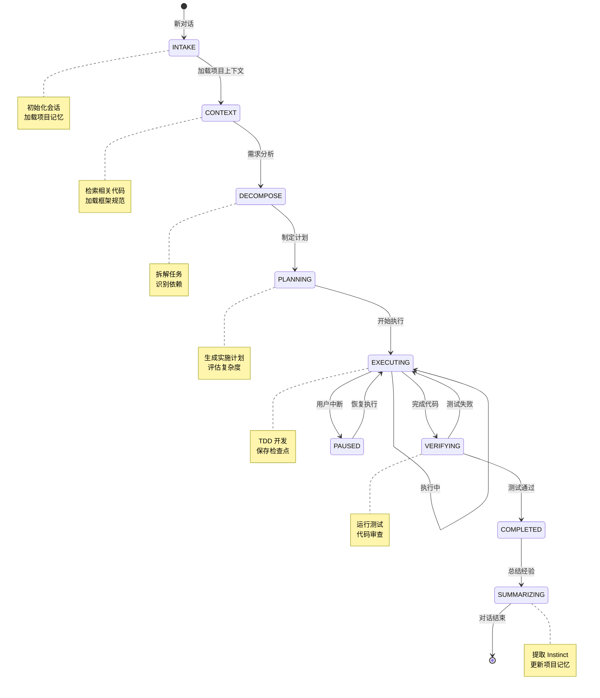

# Conversational State Machine - 智能对话状态机

> **解决核心痛点：长对话记忆丢失、任务中断后无法恢复、重复上下文解释**

## 问题现状

当前 AI 辅助开发工具的对话管理问题：

| 问题 | 影响 |
|------|------|
| **记忆丢失** | 长对话后 AI "忘记"之前的决策 |
| **中断即丢失** | 关闭对话后，任务状态无法恢复 |
| **重复解释** | 每次新对话都要重新说明背景 |
| **缺乏连贯性** | 多轮对话之间缺乏上下文关联 |
| **无法协作** | 团队成员之间无法共享对话历史 |

## 解决方案

借鉴 **Aider Chat 界面**、**SWE-agent Agent 状态管理**、**OpenDevin 事件驱动架构** 等最佳实践，构建智能对话状态机：

---

## 🏗️ 核心架构

### 对话状态模型

```yaml
conversation_state:
  # 会话标识
  session_id: "sess-20260303-001"
  project_id: "proj-abc123"
  start_time: "2026-03-03T10:00:00Z"
  last_update: "2026-03-03T14:30:00Z"

  # 当前状态
  current_state: "EXECUTING"
  current_step: 3
  total_steps: 5

  # 任务摘要
  task_summary:
    title: "实现用户认证系统"
    description: "使用 JWT 实现无状态认证"
    complexity: "中等"

  # 步骤历史
  steps_completed:
    - step: 1
      name: "需求分析"
      status: "completed"
      output: |
        需要实现：
        1. 用户注册（邮箱验证）
        2. 用户登录（JWT Token）
        3. Token 刷新机制

    - step: 2
      name: "架构设计"
      status: "completed"
      decisions:
        - "使用 JWT 进行无状态认证"
        - "密码使用 BCrypt 加密"

  # 当前步骤
  current_step_detail:
    step: 3
    name: "TDD 开发"
    status: "in_progress"
    progress: 0.6
    sub_steps:
      - name: "编写测试用例"
        status: "completed"
      - name: "实现代码"
        status: "in_progress"
      - name: "测试通过"
        status: "pending"

  # 上下文快照
  context_snapshot:
    files_modified:
      - "AuthController.java"
      - "AuthService.java"
      - "JwtTokenProvider.java"

    key_decisions:
      - "Token 有效期 2 小时"
      - "刷新 Token 有效期 7 天"

    pending_issues:
      - "需要添加 Token 黑名单机制"

  # 检查点（用于恢复）
  checkpoints:
    - id: "ckpt-001"
      step: 2
      timestamp: "2026-03-03T11:00:00Z"
      state: "COMPLETED"
      can_resume: true

  # 对话历史（压缩后）
  conversation_history:
    - turn: 1
      user: "实现用户认证系统"
      assistant: |
        分析需求...
        建议使用 JWT...
      summary: "确认使用 JWT 方案"

    - turn: 2
      user: "好的，开始实现"
      assistant: |
        第 1 步：编写测试...
        [测试代码]
      summary: "完成测试用例"
```

---

## 🔄 状态转换图



---

## 💾 检查点机制

### 自动检查点

**借鉴 OpenDevin 的持久化策略**：

```yaml
checkpoint_config:
  # 自动保存时机
  auto_save:
    - trigger: "step_completed"
      description: "每完成一个步骤自动保存"

    - trigger: "file_modified"
      description: "文件修改后保存"

    - trigger: "decision_made"
      description: "重大决策后保存"

    - trigger: "interval"
      description: "每 5 分钟自动保存"

  # 检查点内容
  checkpoint_content:
    - "session_state"           # 完整状态
    - "context_snapshot"        # 上下文快照
    - "files_modified"          # 修改的文件（增量）
    - "conversation_summary"    # 对话摘要
    - "decisions_made"          # 决策记录

  # 检查点保留策略
  retention_policy:
    max_checkpoints: 100
    max_age: "30 days"
    compression: true
```

### 检查点恢复

```bash
# 查看所有检查点
/auto:checkpoint-list

# 恢复到指定检查点
/auto:checkpoint-resume sess-20260303-001

# 继续上次对话
/auto:resume
```

**恢复流程**：

```text
1. 加载检查点
   - 读取 session_state
   - 恢复 context_snapshot
   - 重建对话历史

2. 验证环境
   - 检查文件是否变更
   - 检查依赖是否安装
   - 检查测试是否通过

3. 显示状态
   - 当前步骤
   - 完成进度
   - 待办事项

4. 等待指令
   - 继续执行
   - 修改计划
   - 重新开始
```

---

## 📝 对话历史压缩

**借鉴 Cursor 的记忆提取策略**：

```yaml
compression_config:
  # 压缩策略
  strategy: "progressive"

  # 压缩级别
  levels:
    - level: 1
      name: "detailed"
      keep_turns: 10
      summary: false

    - level: 2
      name: "summary"
      keep_turns: 5
      summary: true
      detail: "medium"

    - level: 3
      name: "compressed"
      keep_turns: 3
      summary: true
      detail: "brief"

  # 触发条件
  triggers:
    - trigger: "token_threshold"
      threshold: 100000  # tokens

    - trigger: "turn_count"
      threshold: 20  # 轮次

    - trigger: "time_elapsed"
      threshold: "1h"

  # 摘要生成
  summarization:
    model: "gpt-4"
    prompt_template: |
      总结以下对话，提取：
      1. 任务目标
      2. 已完成步骤
      3. 待办事项
      4. 关键决策

      对话历史：
      {conversation_history}
```

**压缩示例**：

```text
【原始对话】（20 轮，约 5000 tokens）
User: 实现用户认证系统
Assistant: 好的，我建议使用 JWT...
User: 为什么选择 JWT？
Assistant: JWT 的优势是...
[... 17 轮对话 ...]
User: 测试通过了
Assistant: 很好！现在进行代码审查...

【压缩后】（3 轮，约 500 tokens）
User: 实现用户认证系统
Assistant: [总结] 使用 JWT 实现了无状态认证，包括注册、登录、Token 刷新功能。已完成测试并通过。
User: 继续
Assistant: [当前] 正在进行代码审查，检查安全漏洞和性能问题。
```

---

## 🔄 中断恢复

### 场景 1：意外中断

```text
【执行中】
✅ 第 1 步: 需求分析 - 完成
✅ 第 2 步: 架构设计 - 完成
⏳ 第 3 步: TDD 开发 - 进行中 (60%)
   [====----] 正在实现代码...

【意外中断】（网络断开/系统崩溃）

【恢复】
> /auto:resume

🔄 **正在恢复对话...**

✅ 检查点已加载：sess-20260303-001
📊 当前进度：第 3 步 - TDD 开发 (60%)
📁 待完成：AuthService.java 的 authenticate() 方法

💡 建议：
1. 继续实现 authenticate() 方法
2. 运行测试验证
3. 进入代码审查阶段

是否继续执行？(Y/n)
```

### 场景 2：主动暂停

```text
【执行中】
⏳ 第 3 步: TDD 开发 - 进行中

【用户暂停】
> /auto:pause

✅ **已暂停**
💾 检查点已保存：ckpt-003
📝 可以稍后使用 /auto:resume 恢复执行
```

### 场景 3：跨天继续

```text
【昨天】
> /auto:auto 实现用户认证系统
🚀 开始执行...
⏳ 第 3 步 - TDD 开发 - 进行中 (60%)
> /auto:pause

【今天】
> /auto:resume

🔄 **恢复昨天的对话...**

📅 上次执行：2026-03-02 16:30
⏱️ 间隔：18 小时
📊 当前进度：第 3 步 - TDD 开发 (60%)

💡 回顾：
昨天我们实现了用户认证系统的前半部分：
✅ 完成测试用例
✅ 实现 JwtTokenProvider
⏳ 待完成：AuthService.authenticate() 方法

继续执行？(Y/n)
```

---

## 🗂️ 对话历史管理

### 历史存储结构

```
.aimax/
├── conversations/
│   ├── sess-20260303-001.yaml  # 完整状态
│   ├── sess-20260303-001.checkpoints/  # 检查点
│   │   ├── ckpt-001.yaml
│   │   ├── ckpt-002.yaml
│   │   └── ckpt-003.yaml
│   └── index.yaml  # 对话索引
└── conversation_index.db  # SQLite 索引
```

### 历史查询

```bash
# 查看所有对话
/auto:history-list

# 查看对话详情
/auto:history-show sess-20260303-001

# 搜索对话
/auto:history-search "用户认证"

# 删除对话
/auto:history-delete sess-20260303-001
```

### 对话索引

```yaml
conversation_index:
  - session_id: "sess-20260303-001"
    project_id: "proj-abc123"
    title: "实现用户认证系统"
    start_time: "2026-03-03T10:00:00Z"
    end_time: "2026-03-03T14:30:00Z"
    status: "completed"
    steps_total: 5
    steps_completed: 5
    tags: ["jwt", "authentication", "spring-boot"]
    summary: "使用 JWT 实现了无状态认证系统"
```

---

## 🤖 智能助手能力

### 1. 上下文连贯性

```text
【第 1 轮对话】
User: 实现用户认证系统
Assistant: 好的，我们使用 JWT...

【第 10 轮对话】
User: 这个 Token 怎么生成的？
Assistant: [记住之前的决策]
根据我们第 2 轮的讨论，Token 是这样生成的：
[引用第 2 轮的代码]
```

### 2. 主动状态汇报

```text
【AI 主动汇报】

📊 **进度更新**

✅ **已完成**:
1. 需求分析
2. 架构设计
3. 测试用例编写
4. AuthService 实现

⏳ **进行中**:
- AuthController 实现 (40%)

📝 **待办**:
- Token 刷新机制
- 代码审查
- 测试覆盖率验证

⚠️ **发现的问题**:
- 缺少密码强度验证
- 需要 Token 黑名单机制

是否继续？(Y/n)
```

### 3. 智能建议

```text
【基于历史对话的建议】

💡 **智能建议**

根据你之前在订单系统中的做法（sess-20260215-003），
我建议认证系统也采用类似的 Result<T> 包装：

```java
public Result<TokenDTO> login(LoginRequest req) {
    // ...
    return Result.success(tokenDTO);
}
```

这样可以保持 API 风格的一致性。

是否采用此建议？(Y/n)
```

---

## 📋 命令接口

### 查看当前状态

```bash
/auto:status
```

输出：

```markdown
## 📊 当前会话状态

**会话 ID**: sess-20260303-001
**任务**: 实现用户认证系统
**开始时间**: 2026-03-03 10:00
**已耗时**: 4 小时 30 分钟

### 执行进度
[████████░░] 80% (4/5 步骤)

✅ 已完成:
1. 需求分析
2. 架构设计
3. TDD 开发
4. 自动化门禁

⏳ 进行中:
5. 代码审查 - 60%

📁 修改的文件:
- AuthController.java (新增)
- AuthService.java (新增)
- JwtTokenProvider.java (新增)

💾 最近检查点: ckpt-004 (2 分钟前)
```

### 暂停执行

```bash
/auto:pause
```

### 恢复执行

```bash
/auto:resume [session_id]
```

### 保存检查点

```bash
/auto:checkpoint-save [description]
```

### 查看检查点

```bash
/auto:checkpoint-list
```

### 查看历史

```bash
/auto:history-list
/auto:history-show sess-20260303-001
```

### 清理历史

```bash
/auto:history-cleanup --older-than 30d
```

---

## 🔒 隐私与安全

```yaml
privacy_config:
  # 本地存储
  storage:
    type: "local"
    path: ".aimax/conversations/"

  # 加密
  encryption:
    enabled: true
    algorithm: "AES-256"
    key_file: ".aimax/.key"

  # 敏感信息过滤
  sensitive_data_filter:
    enabled: true
    patterns:
      - "api_key"
      - "password"
      - "token"
      - "secret"

  # 自动清理
  auto_cleanup:
    enabled: true
    max_age: "90 days"
    max_size: "1GB"
```

---

## 🎯 与 /auto:auto 集成

**自动状态管理**：

```text
每次 /auto:auto 执行时：

1. 检查是否有未完成的会话
   - 有 → 询问是否恢复
   - 无 → 创建新会话

2. 执行过程中
   - 每完成一步 → 自动保存检查点
   - 用户输入 → 记录到对话历史
   - 决策 → 记录到 context_snapshot

3. 执行结束
   - 生成最终摘要
   - 提取 Instinct
   - 更新项目记忆
   - 标记会话为 completed

4. 意外中断
   - 自动保存到最近检查点
   - 下次启动时提示恢复
```

---

## 📈 收益对比

| 指标 | 无状态机 | 有状态机 | 提升 |
|------|---------|---------|------|
| **中断恢复** | 不支持 | 秒级恢复 | **新能力** |
| **长对话质量** | 下降（遗忘） | 稳定（记忆） | **+60%** |
| **重复工作** | 多（重新解释） | 少（记住历史） | **-70%** |
| **协作效率** | 低（无法共享） | 高（共享历史） | **+80%** |
| **调试能力** | 弱（无状态追踪） | 强（完整历史） | **新能力** |

---

## 🛠️ 技术实现

### 最小可用方案（MVP）

```python
# 状态存储（YAML）
class ConversationState:
    def save(self, path: str):
        with open(path, 'w') as f:
            yaml.dump(self.state, f)

    def load(self, path: str):
        with open(path, 'r') as f:
            self.state = yaml.safe_load(f)

# 检查点管理
class CheckpointManager:
    def save(self, state: dict):
        checkpoint_id = f"ckpt-{uuid.uuid4().hex[:8]}"
        path = f".aimax/conversations/{session_id}/checkpoints/{checkpoint_id}.yaml"
        with open(path, 'w') as f:
            yaml.dump(state, f)
        return checkpoint_id
```

### 生产级方案

```yaml
tech_stack:
  storage: "SQLite + YAML"
  cache: "Redis"
  compression: "gzip"
  encryption: "AES-256"
```

---

## 🎓 最佳实践

### DO ✅

1. **定期保存检查点**：重要节点手动保存
2. **写清楚的任务描述**：方便后续搜索和理解
3. **及时清理历史**：避免占用过多空间
4. **使用有意义的标签**：便于分类和检索

### DON'T ❌

1. **不要过度依赖自动恢复**：定期手动保存重要节点
2. **不要忽略历史记录**：历史是宝贵的知识库
3. **不要存储敏感信息**：自动过滤密码、密钥等
4. **不要无限保留历史**：定期清理过期对话

---

## 📚 开源借鉴

本项目借鉴了以下优秀开源项目的最佳实践：

- **Aider Chat** - 对话式界面、多轮上下文管理
- **SWE-agent** - Agent 状态追踪、决策记录
- **OpenDevin** - 事件驱动架构、检查点持久化
- **Cursor Memories** - 对话摘要、记忆提取

---

## 🚀 未来演进

### v2.0 规划

- [ ] **多会话并行**：同时处理多个任务
- [ ] **会话分支**：支持尝试多个方案
- [ ] **会话合并**：将多个相关会话合并
- [ ] **AI 驱动总结**：自动生成高质量摘要

### v3.0 愿景

- [ ] **团队协作**：多人共享会话状态
- [ ] **会话市场**：优秀会话可分享/交易
- [ ] **自主会话重组**：AI 自动整理会话形成知识库

---

## 核心原则

1. **状态可恢复** - 任何中断都能恢复
2. **历史可追溯** - 每个决策都有记录
3. **上下文连贯** - 多轮对话保持一致
4. **隐私保护** - 本地加密存储
5. **简单易用** - 一个命令完成所有操作
